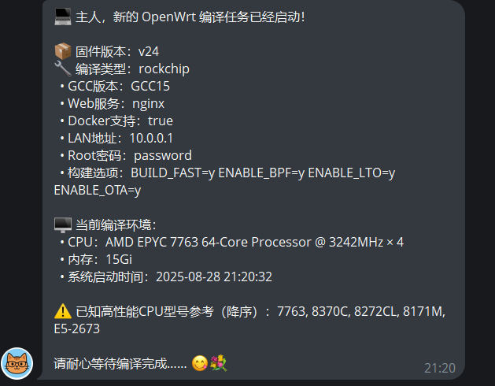
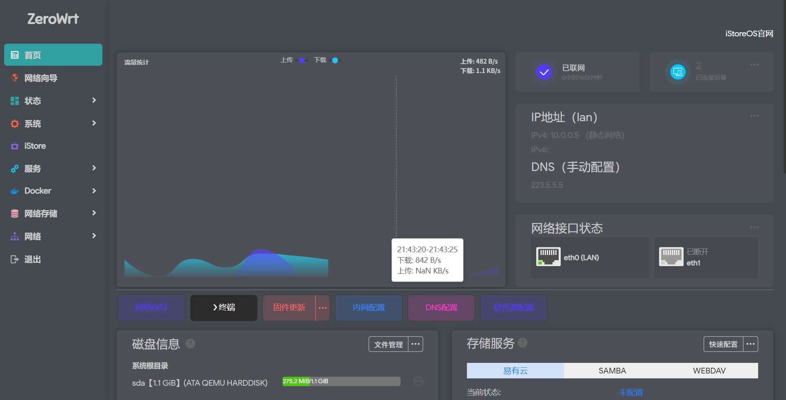
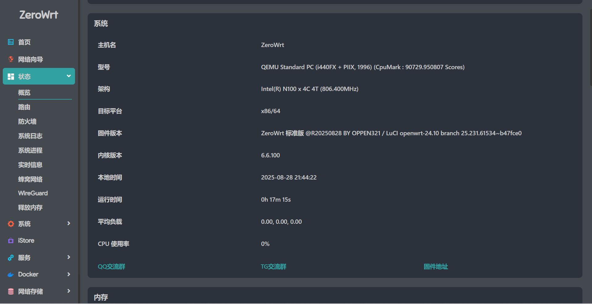
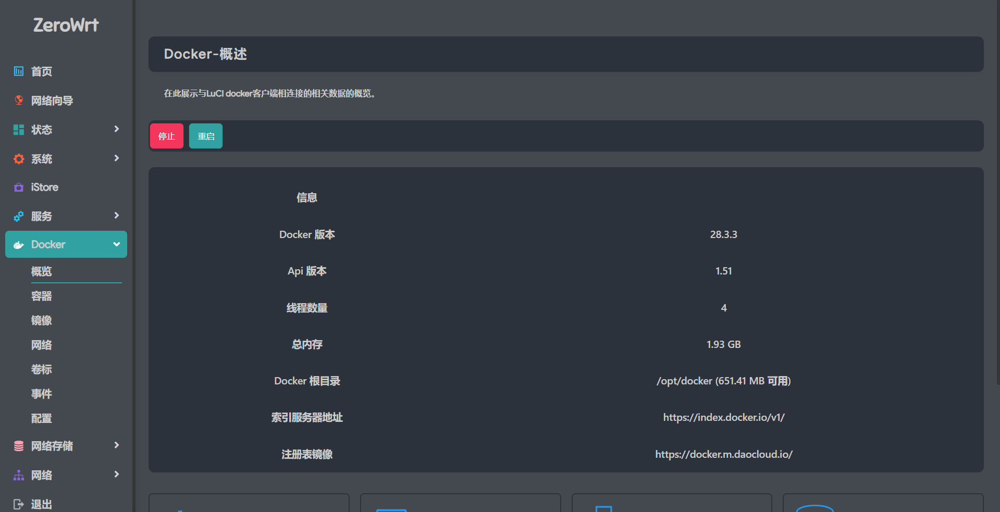

<div align="center">


**基于 [OpenWrt](https://github.com/openwrt/openwrt) 打造的高效固件，覆盖 Rockchip、X86_64 平台，专为进阶用户设计！**  

</div>

---

## 🔍 固件信息概览 
- 🛠 **源码基础**：[OpenWrt 官方]
  - Rockchip、X86_64、ARMv8：基于 [OpenWrt 官方](https://github.com/openwrt/openwrt)

- 🔧 **默认设置**：
  - 管理地址：`10.0.0.1`，密码：`password` 或留空
  - 所有 LAN 口均可访问网页终端和 SSH
  - WAN 默认启用防火墙保护
  - Docker 已切换为国内源，支持镜像加速

- 🚀 **增强支持**（x86_64 / Rockchip）：
  - GPU 硬件加速支持
  - BBRv3 拥塞控制
  - Shortcut-FE 支持 UDP 入站
  - NAT6 和全锥型 NAT（NFT / BCM 方案）

- 🎛 **功能优化**：
  - 内置 ZeroWrt 设置菜单，轻松管理
  - 支持高级插件、自定义启动项

---

## 本地编译环境安装（根据 debian 11 / ubuntu 22）
```shell
sudo apt-get update
sudo apt-get install -y build-essential flex bison g++ gawk gcc-multilib g++-multilib gettext git libfuse-dev libncurses5-dev libssl-dev python3 python3-pip python3-ply python3-distutils python3-pyelftools rsync unzip zlib1g-dev file wget subversion patch upx-ucl autoconf automake curl asciidoc binutils bzip2 lib32gcc-s1 libc6-dev-i386 uglifyjs msmtp texinfo libreadline-dev libglib2.0-dev xmlto libelf-dev libtool autopoint antlr3 gperf ccache swig coreutils haveged scons libpython3-dev jq
```

---

### 启用 [GCC13](https://gcc.gnu.org/gcc-13/)/[GCC14](https://gcc.gnu.org/gcc-14/)/[GCC15](https://gcc.gnu.org/gcc-15/) 工具链编译
##### 只需在构建固件前执行以下命令即可启用 GCC13/GCC14/GCC15 交叉工具链

```
# GCC13
export GCC_VERSION=GCC13
```

```
# GCC14
export GCC_VERSION=GCC14
```

```
# GCC15
export GCC_VERSION=GCC15
```

### 启用 [LTO](https://gcc.gnu.org/onlinedocs/gccint/LTO-Overview.html) 优化
##### 只需在构建固件前执行以下命令即可启用编译器 LTO 优化

```
export ENABLE_LTO=y
```

### 启用 [eBPF](https://docs.kernel.org/bpf/) 支持
##### 只需在构建固件前执行以下命令即可启用 eBPF 支持

```
export ENABLE_BPF=y
```

### 启用本地 Kernel Modules 安装源 （For developers）
##### 启用该标志时，将会拷贝全部 target packages 到 rootfs 并替换 openwrt_core 源为本地方式，以供离线 `opkg install kmod-xxx` 安装操作
##### 这会增加固件文件大小（大约 70MB），对项目内核版本、模块、补丁 有修改的需求时，该功能可能会有用
##### 只需在构建固件前执行以下命令即可启用本地 Kernel Modules 安装源

```
export ENABLE_LOCAL_KMOD=y
```

### 快速构建（仅限 Github Actions）
##### 脚本会使用 [toolchain](https://github.com/NeonPulse-Zero/openwrt_caches) 缓存代替源码构建，与常规构建相比能节省大约 60 分钟的编译耗时，仅适用于 Github Actions `ubuntu-24.04` 环境
##### 只需在构建固件前执行以下命令即可启用快速构建
---

### 更改 LAN IP 地址
##### 自定义默认 LAN IP 地址
##### 只需在构建固件前执行以下命令即可覆盖默认 LAN 地址（默认：10.0.0.1）

```
export LAN=10.0.0.1
```

### 更改默认 ROOT 密码
##### 只需在构建固件前执行以下命令即可设置默认 ROOT 密码（默认：无密码）

```
export ROOT_PASSWORD=password
```

### 使用 uhttpd 轻量 web 引擎
##### 固件默认使用 Nginx（quic） 作为页面引擎，只需在构建固件前执行以下命令即可使用 uhttpd 取代 nginx
##### Nginx 在具备公网的环境下可以提供更丰富的功能支持

```
export web_server=nginx
```

### 禁用全模块编译（For developers）
##### 启用该标志时，固件仅编译 config 指定的软件包和内核模块，但固件不再支持安装内核模块（opkg install kmod-xxx），强制安装模块将会导致内核崩溃
##### 最大的可能性降低 OpenWrt 的编译耗时，适用于开发者调试构建

```
export NO_KMOD=y
```

---

## 构建 OpenWrt 24.10 最新 Releases

### x86_64
```shell
# linux-6.6
bash <(curl -sS https://init.kejizero.online/build.sh) v24 x86_64
```

### rockchip
```shell
# linux-6.6
bash <(curl -sS https://init.cooluc.com/build.sh) v24 rockchip
```

---

## 📡 Telegram 机器人推送设置指南

为了保护你的 Telegram 安全，请在自己的 GitHub 仓库中添加 Secrets，这样可以在编译前后自动接收消息通知。

---

### 📝 1️⃣ 添加 GitHub Secrets

1. 进入你的仓库 → **Settings**  
2. 左侧点击 **Secrets** → 右上角 **New repository secret**  
3. 添加两个 Secrets：  
   | Name   | Value                          |
   |--------|--------------------------------|
   | TGTOKEN | 你的 TELEGRAM_BOT_TOKEN       |
   | TGID    | 你的 TELEGRAM_CHAT_ID         |
4. 点击绿色按钮 **Add secret** 保存 ✅

---

### 🤖 2️⃣ 创建 Telegram 机器人

1. 在 Telegram 搜索 **BotFather**  
2. 点击 **/start**  
3. 输入 **/newbot** 创建新机器人  
4. 设置机器人名称，例如：`danshui`  
5. 设置机器人用户名，必须以 `_bot` 结尾，例如：`danshui_bot`  
6. 创建完成后，你会看到类似的 **HTTP API**：9876543201:FEDCBA_dfoiuweSWEczgxT7-l4r9Y - 这就是你的 **TELEGRAM_BOT_TOKEN (TGTOKEN)** ⚠️ 请勿泄露  
7. 给机器人发送一条任意消息，这样后续获取 ID 才能成功 💌  

---

## 🆔 3️⃣ 获取 TELEGRAM_CHAT_ID (TGID)

### 方法一：使用 @GetMyID 机器人
1. 搜索 `@GetMyID`  
2. 点击 **Start**  
3. 会显示你的 **TGID**  

### 方法二：使用你创建的机器人
1. 确保你已经给机器人发送过消息  
2. 将你的 **TGTOKEN** 替换到下面链接中：https://api.telegram.org/bot<你的TGTOKEN>/getUpdates - 示例：https://api.telegram.org/bot9876543201:FEDCBA_dfoiuweSWEczgxT7-l4r9Y/getUpdates
3. 在浏览器打开该链接  
4. 找到 `"from":{"id":1239000174,"is_bot":...}`  
- 其中的 **1239000174** 就是你的 **TGID** 🆔  

---

## 💡 4️⃣ 小贴士

- 确保 **TGTOKEN** 和 **TGID** 都是你自己获取的，不要使用他人的  
- 给机器人发送消息是获取 ID 的关键步骤  
- 设置完成后，如果开启了 SSH，系统可以自动发送编译前后的信息到 Telegram 🎉  

---

## 📸 5️⃣ 功能展示




## 💾 ZeroWrt 固件烧写（SD）

**推荐工具：**<a href="https://www.balena.io/etcher/" target="_blank" ></a>

**SD卡容量：2GB 或更多**

*固件文件无需解压，直接使用工具写入 microSD 卡*

------

## 🛠️ 固件烧写

### 📦 准备工具

- **电脑（Windows），其它操作系统自行搜索相关工具**
- **数据线：USB-A to USB-A 或 Type-C to USB-A**
- **瑞芯微开发工具：**<a href="https://git.kejizero.online/zhao/document/raw/branch/main/RKDevTool_Release_v2.84.zip" target="_blank" >RKDevTool_Release_v2.84.zip</a>

- **Mask 设备驱动：**<a href="https://git.kejizero.online/zhao/document/raw/branch/main/DriverAssitant_v5.1.1.zip" target="_blank" >DriverAssitant_v5.1.1.zip</a>

### 📥 准备固件

- **下载固件文件，并解压出 .img**

### 🚀 操作过程

- **安装 Mask 设备驱动**

- **Mask 模式连接电脑（R5S 断电状态下，取下 SD 卡，使用数据线连接电脑。长按 “Mask” 按钮，接通 R5S 电源直至电脑发现新设备后释放 “Mask” 按钮）**

  


- **打开 瑞芯微开发工具：正常状态：（发现一个Maskrom设备）  缺少驱动：（没有发现设备）**

  **安装步骤：**
  
  **① 点击 “system” 路径选择按钮（选择 zip 解压出来的 IMG 文件）**
  
  
  
  
  
  **② 点击 “执行”（固件写入完成后会自动重启进入 OpenWrt 系统）**
  
  
  
- ***注意：通过电脑烧写固件请使用本站下载的 [瑞芯微开发工具](https://git.kejizero.online/zhao/document/raw/branch/main/RKDevTool_Release_v2.84.zip)。***

------

## 📤 固件烧写（SD to eMMC）

```shell
# 1、下载最新 Releases 固件并通过 SD 卡启动
# 2、使用 Xftp 等工具上传一份固件到 /tmp 目录，或通过终端 wget 在线下载固件到 /tmp 目录

# 3、使用内建命令写入固件到 eMMC 存储（请根据实际文件名称与路径）

emmc-install /tmp/xx-squashfs-sysupgrade.img.gz

```

**固件写入完成后，取下 SD 卡，手动断电重启即可完成。**

------

## 📂 固件展示 / 预览截图

<div align="center">

  
  
  


</div>

---

## 💬 交流群与支持

如有技术问题或想交流使用经验，可加入我们的讨论群：

- 🧧 QQ 交流群：579896728 👉 [点击加入](https://qm.qq.com/q/oe4EAtvPIO)
- 🌐 Telegram 群组 👉 [点击加入](https://t.me/kejizero)

---

## 💰 打赏支持

感谢你的支持，我们会将每一笔打赏用于改善服务与开发。**打赏 20 元以上可获取 VIP 区域访问权限！**

👉 [点击打赏](https://pay.kejizero.online)

---

## 🏆 鸣谢 [](#鸣谢-)
| [ImmortalWrt](https://github.com/immortalwrt) | [coolsnowwolf](https://github.com/coolsnowwolf) | [P3TERX](https://github.com/P3TERX) | [Flippy](https://github.com/unifreq) |
| :-------------: | :-------------: | :-------------: | :-------------: |
|  |  |  |  |
| [sbwml](https://github.com/sbwml) | [SuLingGG](https://github.com/SuLingGG) | [QiuSimons](https://github.com/QiuSimons) | [padavanonly](https://github.com/padavanonly/immortalwrt-mt798x-24.10) |
|  |  |  |  |

---

## ⚠️ 免责声明

> - 本固件仅供学习研究，请勿用于商业用途  
> - 使用本固件所带来的一切后果由使用者自行承担  
> - 不保证完全无 bug，开发者不提供定制支持  
> - 请遵守国家网络安全相关法律法规  

## 如果你喜欢这个项目的话别忘了点个Star⭐
[](https://starchart.cc/NeonPulse-Zero/ZeroWrt)
